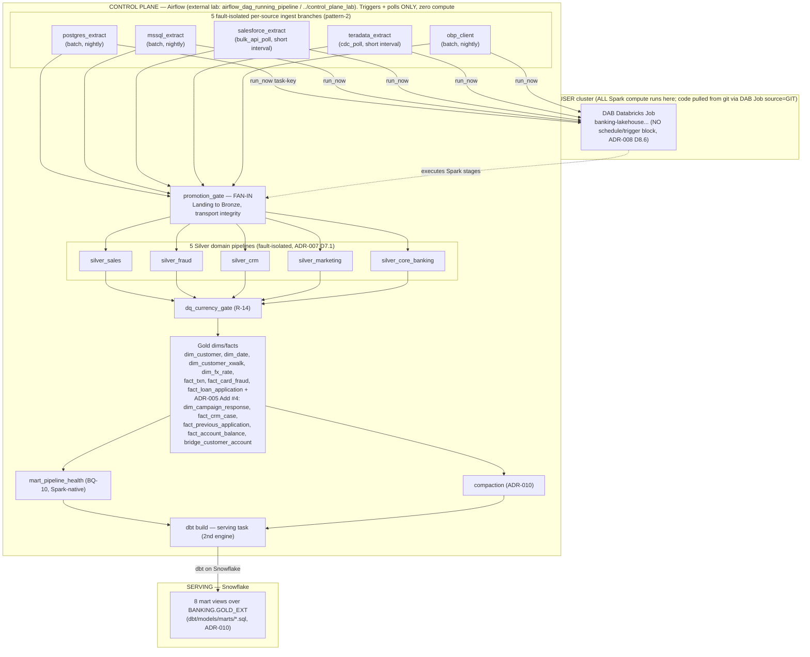

# ADR-011 — External Airflow orchestration (pattern-2 per-source fan-in) and Terraform scope boundary

**Status:** Accepted (2026-07-19). NOTE: D11.1's trigger granularity, the topology diagram, and
the Addendum-#1 stage-mapping table are PARTIALLY SUPERSEDED by **Addendum #2** after a
`databricks.yml` ground-truth check — see the inline banners and Addendum #2. The core ruling
(Airflow adopted, EXTERNAL, D-10-compliant, per-source fault isolation) stands.
**Date:** 2026-07-18 (Addendum #1: 2026-07-19; Addendum #2: 2026-07-19)
**Owners:** owner (directed), staff-data-engineer (stack/tool authority + control-plane topology sign-off)
**Context refs:** ADR-007 D7.3/D7.5 + Add #2 (config-driven `orchestrate.py`, `--poll-seconds`
cadence loop, D-10 no-private-scheduler); ADR-008 D8.1 (DAB-over-Terraform for Jobs) + D8.6 (DAB
Job = control-plane contract surface, NO `schedule`/`trigger` block); ADR-002 Add #6 (git-native
`run_now`, agent-triggered on owner prompt) + Add #2–#5 (cloud primitives = owner console/one-off);
ADR-006 Add #2 (Berka source = Salesforce, not SAP HANA); ADR-005 Add #4 (Silver→Gold promotions);
ADR-010 (compaction, dbt serving); `journey/07_PIPELINE_SPEC.md` "Orchestration" (D-10 contract,
`../control_plane_lab/03_PIPELINE_SIDE_CONTRACT.md`). This ADR is the decision-of-record the owner
will BUILD from later; it defines the topology, it does not implement it.

**No model veto triggered — stated explicitly per doctrine ("what's deliberately out stays
named").** This ADR touches control-plane orchestration and infra tooling ONLY. It changes no
model, no schema, no grain, no storage path, no SCD strategy, no bridge/dim/fact definition. The
star schema (ADR-005), the MDM crosswalk (D-04), the medallion storage paths (ADR-003), and the
dbt serving views (ADR-010) are all untouched. The Clean-ERD doctrine gate does not fire.

---

## Context

Two owner fasas need a decision-of-record before any build:

1. **Stand up Airflow orchestration.** D-10 already forbids a private Airflow inside THIS repo;
   the repo exposes only a control-plane *contract* (a DAB Databricks Job with no schedule block,
   ADR-008 D8.6) that a SEPARATE project drives via `run_now`. What is undecided is the *topology*
   of that external DAG: how many DAGs, how the 5 sources fan in, where the orchestrate/compute
   boundary sits, and how idempotency is keyed. That topology is what this ADR fixes.

2. **Evaluate Terraform.** ADR-008 D8.1 already rejected Terraform for the Databricks Jobs IaC
   layer (DAB won). What ADR-008 explicitly left open is whether Terraform earns a home for the
   *cloud primitives* (S3 bucket, IAM role/policy, UC storage credential, cluster) currently kept
   as owner-console/one-off actions (ADR-002 Add #2–#5). Codifying those is a scope expansion, not
   a re-litigation of D8.1 — this ADR is the amendment that either opens or closes that door.

**Territory check (map-vs-territory, done THIS turn — three divergences from the task brief that
this ADR corrects and builds on the real graph, not the summary):**

- **D-i (source list).** The brief named `sap_hana` as a source. The real graph
  (`pipeline/orchestrate_config.yml` lines 34-47) has **`salesforce_extract` (`bulk_api_poll`)**, not
  SAP HANA — ADR-006 Add #2 replaced Berka's SAP-HANA simulation with a Salesforce Developer org.
  The 5 real ingest branches are `postgres_extract` (batch), `mssql_extract` (batch),
  `salesforce_extract` (bulk_api_poll), `teradata_extract` (cdc_poll), `obp_client` (batch).
  *(CLAUDE.md's stack table still says "SAP HANA Cloud" — stale relative to ADR-006 Add #2; flagged
  to the owner below, not silently corrected here.)*
- **D-ii (Gold breadth).** The brief said "6 Gold dims/facts." Territory
  (`orchestrate_config.yml:82-146`) has **7 core dims/facts + 5 ADR-005 Add #4 promotions
  (`dim_campaign_response`, `fact_crm_case`, `fact_previous_application`, `fact_account_balance`,
  `bridge_customer_account`) + `dq_currency_gate` + `compaction`.** The diagram groups these for
  legibility but the DAG must carry the real dependency edges.
- **D-iii (marts / serving).** The brief said "9 marts → dbt serving." Territory: the **8 analytics
  marts were RETIRED from orchestration on 2026-07-18 (`orchestrate_config.yml:148-187`) and are now
  dbt Snowflake VIEWS** (`dbt/models/marts/*.sql`, 8 files verified). Only `mart_pipeline_health`
  (BQ-10) remains a Spark-native Gold stage. This materially shapes the topology: the terminal
  Airflow stage is **not** a Spark mart fan-out — it is a **`dbt build` task against Snowflake**,
  a second execution engine the DAG must trigger after the Databricks Job succeeds.

**`../control_plane_lab/` presence:** verified absent from this workspace
(`ls ../control_plane_lab/ 2>/dev/null` → not present; `../airflow_dag_running_pipeline/` also
absent). Per the brief's instruction: this ADR is therefore the record that **DEFINES the topology
the future external lab must implement**, and the `03_PIPELINE_SIDE_CONTRACT.md` referenced in
`journey/07_PIPELINE_SPEC.md` (line 43) is **(unverified — dir not present in this workspace)**.

---

## Decision

### D11.1 — Airflow: YES, as the external orchestrator, in pattern-2 per-source fan-in. RECOMMENDED.
Airflow is adopted as the cadence owner, living in the SEPARATE `airflow_dag_running_pipeline` /
`../control_plane_lab/` project (D-10 unchanged — no Airflow code lands in THIS repo). It drives
this repo's DAB Databricks Job via the Databricks provider's submit-and-poll operators
(`DatabricksRunNowOperator` against the DAB-deployed Job, or `DatabricksSubmitRunOperator` per
task-key), consuming the control-plane contract surface ADR-008 D8.6 defined. Airflow **triggers
and polls; it never computes** (see D11.4 anti-pattern #1). Topology = **pattern-2: 5 fault-isolated
per-source ingest branches → shared `promotion_gate` fan-in → 5 Silver → Gold dims/facts →
`mart_pipeline_health` + `compaction` → a terminal `dbt build` serving task.**

> **[SUPERSEDED IN PART by Addendum #2, 2026-07-19]** D11.1's "per-source ingest branch → `run_now`
> task-key → JOB" granularity is corrected by Addendum #2 after a `databricks.yml` ground-truth
> check: the DAB job is ONE job with a 22-task internal graph, so Airflow triggers the WHOLE job via
> a single `DatabricksRunNowOperator` (a COARSE DAG), and the 5 source→Landing extractions run on an
> Airflow extraction executor, not on Databricks. The Airflow-adopted / external / D-10-compliant /
> per-source-fault-isolation decision itself stands.

### D11.2 — Terraform: NARROW-SCOPE, DEFERRED behind a scope gate. Do NOT adopt for Jobs (D8.1 stands).
Terraform is **not** adopted now, and is **permanently barred** from the Databricks Jobs layer —
DAB is and remains the sole owner of the Job resource (ADR-008 D8.1; two owners = drift = the exact
anti-pattern ADR-008 closed, see D11.4 #3). Terraform's *only* legitimate candidate home is the
**cloud primitives** kept as console/one-off today (S3 bucket, IAM role/policy, UC storage
credential + external location, the `SINGLE_USER` cluster def; ADR-002 Add #2–#5). Codifying those
is a **SCOPE EXPANSION** that this ADR does **not** authorize — it is **routed to `@scope-guardian`
(hard veto, ADR-000 intake)** and `@finops` (any new metered/stateful cost)**; this ADR only defines
*where Terraform could sit if approved* and *why it is deferred* (portfolio-cost/benefit in the
trade-off table). Recommended default if the owner wants the IaC-completeness signal without the
scope fight: **a single read-only `terraform plan`-only showcase of the existing primitives (no
`apply`, no `.tfstate` of record), demoing the skill without taking ownership of live infra.**

### D11.3 — DAG granularity: per-source-DAGs-fan-in (pattern-2), NOT one monolithic DAG.
Each of the 5 sources is its own Airflow DAG (or TaskGroup) so a source failure is fault-isolated
(mirrors ADR-007 D7.1's Silver-split rationale one layer up). They fan IN at `promotion_gate`.
Cadence is split at the source-DAG level, honoring ADR-007 D7.3 + Add #2's real cadence field:
`batch` sources (postgres, mssql, obp) on a nightly schedule; `cdc_poll` (teradata) and
`bulk_api_poll` (salesforce) on a short interval. This is the Airflow-native expression of the
`--poll-seconds` behavior ADR-007 Add #2 already built into `orchestrate.py` — Airflow replaces the
poll loop, it does not duplicate it (see D11.4 #2).

### D11.4 — `orchestrate.py` is NOT retired; it is the local dev-loop sequencer, Airflow is the cloud cadence owner.
Same split ADR-008 D8.6 drew between "CD deploys, Airflow schedules": `orchestrate.py` /
`orchestrate_config.yml` remain the **$0 local dev-loop** dependency-aware runner (D-14 portability;
runs against local Spark sample data with `JAVA_HOME=/usr/lib/jvm/java-17-openjdk-amd64`). Airflow
owns the **cloud/canonical cadence** by calling `run_now` on the DAB Job. The `orchestrate_config.yml`
dependency graph is the **single source of truth for the DAG shape**; the external Airflow DAG must
be generated from / reconciled against it, never hand-drifted (contract: the future
`03_PIPELINE_SIDE_CONTRACT.md` publishes this graph as the pipeline-side interface).

### D11.5 — Idempotency is keyed off the run's DATA INTERVAL, never `now()`.
The external DAG MUST pass Airflow's `data_interval_start`/`data_interval_end` (logical date) into
each extractor's watermark as job parameters, so a backfill for 2026-07-01 pulls that day's window,
not "everything up to wall-clock now." This binds to `pipeline/common/watermark.py`'s existing
watermark contract. Getting this wrong corrupts backfills (D11.6 anti-pattern #4) — it is the single
highest-risk correctness item in the whole thread.

---

## DAG topology (pattern-2 per-source fan-in)

> **[SUPERSEDED by Addendum #2, 2026-07-19]** — this diagram shows per-extract `run_now → task-key`,
> which does not match `databricks.yml` (ONE 22-task job, no extract task-keys). See Addendum #2 for
> the corrected COARSE Airflow DAG (ingestion tier vs processing tier, single `DatabricksRunNowOperator`)
> and the corrected reference inventory. Retained here for the reasoning trail.

Boundary made visual: everything in **CONTROL PLANE (Airflow)** only *triggers and polls*; all Spark
compute runs in the **DATA PLANE (Databricks)**; serving views build in **Snowflake**. Airflow holds
zero Spark.



Notes on fidelity to territory: `promotion_gate` in the real repo is a **single shared** Landing→Bronze
stage depending on all 5 extracts (`orchestrate_config.yml:50-53`) — it is the fan-in point, so
per-source Bronze fault-isolation would require `promotion_gate` to accept a `--source` filter (a
build/contract detail for `@senior-data-engineer`, not decided here). `dim_customer_xwalk`,
`dim_date`, `dim_fx_rate` have `depends_on: []` (seed-time artifacts / calendar generation) and are
shown inside the Gold group for readability.

---

## Alternatives considered (and rejected — with reason)

### (a) Orchestrator choice
| Option | Market demand (directional) | Learning curve | Portfolio signal | Fit with run_now contract | Op burden | Verdict |
|---|---|---|---|---|---|---|
| **Airflow** | Highest / most-deployed, most enterprise incumbency (directional, WebSearch) | Moderate (Python DAGs) | Strong — the default DE orchestrator interviewers expect | Native `DatabricksRunNowOperator`; submit-and-poll is first-class | Moderate (scheduler+webserver+metadb, or Astro/MWAA) | **CHOSEN** |
| Dagster | Growing fast, esp. dbt-heavy greenfield (directional) | Moderate (asset model is a rethink) | Strong + differentiated (asset-centric pairs with dbt) | Good (Databricks + dbt integrations) | Moderate | Rejected for v1: Airflow's incumbency wins the "default orchestrator" portfolio slot; Dagster is the stronger *second* showcase later if the owner wants the dbt-asset story |
| Kestra | Emerging, smaller job-market footprint (directional) | Low (YAML declarative) | Novel but thinner hiring signal | Good (declarative task calls) | Low | Rejected: least established hiring demand; YAML-declarative signal already covered by DAB + dbt |
| Keep `orchestrate.py` only | n/a (bespoke) | n/a (owned) | Weak as the *sole* orchestrator — reads as "didn't reach for the industry tool" | It IS a local sequencer, not a scheduler | Low | Rejected as the cloud orchestrator; RETAINED as the dev-loop runner (D11.4) — not either/or |

### (b) DAG granularity
| Option | Why |
|---|---|
| One monolithic DAG | Rejected — a single source failure blocks the whole run; opposite of ADR-007 D7.1's fault-isolation rationale carried up to the orchestration layer |
| **Per-source DAGs → fan-in (pattern-2)** | **CHOSEN** — each source fault-isolated, cadence-split at the DAG level (batch vs cdc_poll vs bulk_api_poll), fanning into the shared `promotion_gate`; mirrors the real dependency graph |
| Cadence-split only (batch-DAG vs streaming-DAG, sources mixed) | Rejected — groups unrelated sources by clock, loses per-source fault isolation and per-source backfill control |

### (c) IaC per infra layer
| Infra layer | Terraform | DAB | Console/one-off | Ruling |
|---|---|---|---|---|
| Databricks **Jobs** (tasks, depends_on, git_source, cluster binding) | Rejected (D8.1: `.tfstate` rot after disposable-trial delete, less Databricks-native) | **OWNS IT** (ADR-008 D8.1) | retired | **DAB — closed, do not reopen** |
| S3 bucket / IAM role+policy / UC storage credential + external location | *Candidate* (Terraform's home turf) | out of scope (not a Databricks resource) | current state (ADR-002 Add #2–#5) | **DEFERRED — scope call to `@scope-guardian`, cost to `@finops`; interim recommendation: `plan`-only read-only showcase, no `apply`/state-of-record** |
| `SINGLE_USER` cluster definition | *Candidate* (or a DAB bundle variable) | partial (cluster-id is a DAB variable, ADR-008 Consequences) | current state | **DAB variable suffices today; Terraform only if the primitives layer is approved as one unit** |

---

## Anti-pattern check (highest-value section)

1. **Compute-inside-Airflow** — a `PythonOperator` importing PySpark and running a transform on the
   Airflow worker. Fails: the worker is not a Spark cluster; you either get a toy single-node run
   that lies about scale, or you drag the whole medallion off Databricks (violates ADR-002 stack +
   D-14). **Correct pattern:** submit-and-poll — `DatabricksRunNowOperator`/`DatabricksSubmitRunOperator`
   triggers the DAB Job on the `SINGLE_USER` cluster and polls for terminal state. Airflow holds
   zero Spark. This is the boundary the diagram makes visual (CONTROL PLANE vs DATA PLANE).
2. **In-repo scheduler duplicating the external lab (D-10 violation)** — adding an Airflow deployment,
   or a `schedule:` cron in `cd.yml`, INSIDE this repo. Fails D-10 and pre-empts the external lab
   (exact ground ADR-008 D8.6 stands on). **Correct pattern:** Airflow lives in
   `airflow_dag_running_pipeline`; this repo exposes only the DAB Job contract (no schedule block).
   `orchestrate.py` stays a $0 local *sequencer*, explicitly not a scheduler (ADR-007 D7.3).
3. **Terraform re-owning Jobs that DAB already owns** — two IaC tools reconciling the same Job
   resource. Fails: divergent state, silent drift — the precise anti-pattern ADR-008 D8.1 closed.
   **Correct pattern:** one owner per resource. DAB owns Jobs; Terraform (if ever approved) owns only
   cloud primitives DAB cannot express, with a clean seam between them.
4. **execution-date/data-interval idempotency violation** — extractors keying watermarks off `now()`
   instead of the run's data interval. Fails: a backfill for an old logical date pulls the current
   window and corrupts history; re-runs are non-deterministic. **Correct pattern (D11.5):** pass
   `data_interval_start`/`_end` as Job params into `pipeline/common/watermark.py`; the DAG is a pure
   function of its logical date. Named here as the top correctness risk of the build.

---

## Market-demand + portfolio-skill lens

- **Directional signal (WebSearch, 2026 — directional only, not counts):** Airflow remains the
  most-deployed/most-documented orchestrator and the default enterprise incumbent; Dagster is
  growing fastest in dbt-heavy greenfield (asset-centric); Kestra is an emerging YAML challenger with
  a smaller hiring footprint. For a portfolio meant to be interview-defensible, Airflow is the
  highest-leverage single orchestrator to demonstrate.
- **Non-repeated skill?** YES for Airflow-as-external-orchestrator + `DatabricksRunNowOperator`
  submit-and-poll + data-interval backfill — this is a genuinely NEW skill not shown by the DAB
  (deploy) or `orchestrate.py` (local sequencer) work. The value-add is precisely the
  *orchestrate-vs-compute boundary* and *cross-project control-plane contract*, which neither prior
  artifact demonstrates. Terraform would be a **repeated IaC signal** (DAB already shows declarative
  infra-as-code) unless scoped to cloud primitives DAB genuinely cannot express — which is exactly
  why D11.2 defers it rather than adding a second same-shaped IaC story.

---

## Consequences / Reversibility / blast-radius

- **Airflow thread — HIGH reversibility, LOW blast-radius on THIS repo.** The entire Airflow
  footprint lives in a *separate* project; this repo's only obligation is to keep the DAB Job
  contract stable (no schedule block) and to publish `orchestrate_config.yml`'s graph as the
  pipeline-side contract. Undo = stop running the external DAG; the DAB Job and `run_now` interim
  path (ADR-002 Add #6) still work by hand. No data-plane object moves.
- **Terraform thread — reversibility depends on scope.** `plan`-only showcase = HIGH reversibility,
  near-zero blast-radius (no `apply`). Full primitive ownership = LOWER reversibility (a `.tfstate`
  of record that must be stored/secured and that rots when the disposable trial is deleted, D-14 —
  the exact fragility ADR-008 D8.1 cited) and HIGHER blast-radius (Terraform now gates live S3/IAM).
  This asymmetry is why D11.2 defaults to `plan`-only and routes the ownership question out.
- **Does NOT decide:** the Airflow hosting choice (self-managed vs Astro vs MWAA — `@finops` owns any
  metered cost); the exact `03_PIPELINE_SIDE_CONTRACT.md` schema (defined when the external lab is
  built); whether `promotion_gate` gains a `--source` filter for per-source Bronze isolation
  (`@senior-data-engineer` build detail); whether Terraform's cloud-primitive scope is approved at
  all (`@scope-guardian` hard veto); the Terraform state backend if it ever is; the credit ceiling
  for canonical Airflow-triggered runs (`@finops`). No BQ, mart, model, grain, or storage path is
  added or moved.

---

## Routing (named, not silently assumed)

- **`@scope-guardian` (hard veto, ADR-000 intake):** Terraform-for-cloud-primitives (D11.2) is a
  SCOPE EXPANSION beyond the 10-BQ v1 and beyond ADR-008 D8.1's Jobs-only IaC ruling — it needs an
  intake decision before any `.tf` of record is written. The Airflow *external* adoption is
  D-10-sanctioned and does not touch this repo's scope; informational, not a veto trigger. Scope
  guardian confirms.
- **`@finops`:** any metered cost from (a) canonical Airflow-triggered `run_now` cluster runs and
  (b) a managed Airflow host (Astro/MWAA) or a Terraform state backend. This ADR makes both
  *gateable*; it does not set a number.
- **`@senior-data-engineer`:** owns the eventual build — the external DAG, the
  `DatabricksRunNowOperator` wiring, the data-interval watermark plumbing (D11.5), and any
  `promotion_gate --source` change; plus the `plan`-only Terraform showcase if D11.2's interim is taken.
- **`@staff-data-engineer` (this ADR):** holds the control-plane topology + IaC-tool ruling; no
  model veto fired (data model untouched).

---

## Addendum log

### Addendum #1 (2026-07-19) — Owner's local-debug Airflow request: ruling = LOCAL DEV HARNESS, not in-repo override. D-10 stays intact.

**Trigger.** Owner directed (Malay, paraphrased): "implement Airflow inside this project; ignore the
ADR lock — reason: it's easier to debug/troubleshoot/optimize within this project's own
environment." Main session correctly escalated the D-10 conflict here for a ruling rather than
building. This addendum is that ruling. It does NOT re-open D11.1–D11.5 (external Airflow as cloud
cadence owner still stands and is reaffirmed); it ANSWERS a question the body did not: the owner's
goal is **local developer ergonomics**, not cloud cadence, and the body was scoped to cadence.

**What the owner actually wants (goal, restated from the reason, not the mechanism).** The stated
mechanism was "put Airflow in the repo / override D-10." The stated *reason* was debug /
troubleshoot / optimize *within this environment*. Those are separable. Decomposing the reason
against the verified gaps of `orchestrate.py` (read this session): what Airflow gives that
`orchestrate.py` does not — (1) a web UI with grid + graph views, (2) per-task logs in that UI,
(3) run HISTORY (`write_run_status` in `pipeline/common/watermark.py` lines 80-91 is confirmed
**overwrite-per-stage, latest-status-only, no history** — one JSON per stage), (4) clear-and-rerun
a single task, (5) retry policy, (6) alerting. Every one of those six is a *local dev-loop
ergonomics* win. NONE of them requires the Airflow code to be a tracked, shipped artifact of THIS
repo — they require Airflow to be *runnable in the owner's working environment pointed at the
pipeline's portable `main()` entrypoints*.

**Ruling (Option d — chosen over owner's literal Option a, over body's Option b-only, over Option c).**
Adopt Airflow as a **git-ignored, boundary-contract-excluded, non-shipped LOCAL DEV HARNESS** that
lives in the workspace (so it is genuinely "within this project environment" for debugging) and
drives the SAME portable entrypoints `orchestrate.py` already calls. This is the SAME Airflow
artifact as the external lab of D11.1, run in a second mode:

- **Canonical/cloud mode (D11.1, unchanged):** DAG → `DatabricksRunNowOperator` → DAB Job on the
  `SINGLE_USER` cluster. Lives in `airflow_dag_running_pipeline` / `../control_plane_lab/`.
- **Local-debug mode (this addendum):** the SAME DAG, in a `dev_orchestration/` harness that is (a)
  listed in `.gitignore` so it is NOT committed, (b) NOT referenced by `databricks.yml`, `ci.yml`,
  or `cd.yml`, (c) NOT imported by any module under `pipeline/**`, drives each task via a
  `BashOperator`/`@task` that shells `python -m pipeline...` (the same `def main() -> int`
  entrypoint `orchestrate.py` calls) against local Spark sample data with
  `JAVA_HOME=/usr/lib/jvm/java-17-openjdk-amd64`. Delete the harness folder and the pipeline still
  runs headless via `orchestrate.py` — portability (D-14) is provably preserved.

**Why this and not the owner's literal "in-repo, override D-10" (Option a).** The tracked-in-repo
variant carries the ENTIRE doctrine cost of a D-10 override — permanent coupling of the compute repo
to a control-plane tool, `import dlt`-style portability erosion, and guaranteed drift between an
in-repo DAG and the external lab's DAG (two homes for one topology = the exact two-owner drift
D11.4 #3 / ADR-008 D8.1 exist to prevent) — while delivering **zero incremental debugging benefit**
over the git-ignored harness. The only thing "tracked in this repo's git" adds beyond the harness is
that the DAG files are version-controlled *here* rather than in the lab; that single delta is what
costs the override, and it is not a debugging capability. The trade is lopsided: pay the full
override price for a non-debugging convenience. Declined on the merits, not reflexively — the owner's
GOAL is fully met by Option d.

**Why this and not body-Option-b-only (external lab only).** The pure-external framing forces the
owner to leave "this environment" to debug, which is precisely the friction the owner named. The
harness mode closes that without a second tool or a D-10 override.

**Why this and not Option c (upgrade `orchestrate.py` only).** Option c (append-only run history +
a retry counter in `orchestrate.py`) is a real, $0, D-10-safe improvement and is **ADOPTED as an
adjacent low-cost win** (see below) — but it does NOT deliver the UI / graph / clear-and-rerun /
alerting that drive the owner's "troubleshoot/optimize" ask, and it re-invents a bespoke slice of
Airflow instead of demonstrating the industry tool (weak portfolio signal, ADR-011 body alt-table
row 4). So c is a complement, not the answer.

**D-10 is NOT overridden — it is SCOPED, explicitly, to remove the ambiguity the owner hit.**
D-10 = "no private Airflow inside this repo." Read against its own rationale (portability / the
transforms must survive the trial-workspace delete / don't pre-empt the external lab / boundary
contract), D-10 bans Airflow as a *tracked, shipped, critical-path artifact of this repo*. It does
NOT ban the owner running Airflow in their own workspace as a throwaway dev tool that calls the
portable entrypoints — that preserves every value D-10 protects. To avoid a silent workaround
(doctrine: surface it in an ADR, don't lawyer it in code), D-10's scope is hereby stated:

- **D-10 BANS (unchanged):** Airflow code committed to this repo; any `schedule:`/cron in `ci.yml`
  or `cd.yml` or `databricks.yml`; any `pipeline/**` module importing `airflow`; Airflow on the
  portable critical path such that deleting it breaks a headless `orchestrate.py` run.
- **D-10 PERMITS (clarified):** a git-ignored, non-shipped, `pipeline/**`-independent local Airflow
  dev harness (`dev_orchestration/`) that drives the same portable `main()` entrypoints for
  debugging, and that is byte-for-byte deletable with zero effect on the shipped pipeline.

No `import airflow` ban exists today (verified this turn: `gates/framework.yml` lines 67-68
`banned_imports` lists **only** `dlt`); this addendum deliberately does NOT add one, because the
harness legitimately imports Airflow — instead the harness is fenced by `.gitignore` +
boundary-exclusion, and `boundary_contract.py`/`secrets_scan.py` must be confirmed to skip
`dev_orchestration/` when the harness is built (build-time check, `@senior-data-engineer`).

**Adjacent adopted win (from Option c), $0, D-10-safe, independent of the harness.** Change
`write_run_status` (`pipeline/common/watermark.py` lines 80-91) from overwrite-per-stage to **append-only
history** (e.g. one row appended per run keyed on stage + `written_at`, `read_run_status` returns
the latest). This (1) directly feeds `mart_pipeline_health` (BQ-10) a real run-history instead of
latest-status-only, and (2) gives the local harness AND `orchestrate.py` a durable audit trail
independent of Airflow's own metadb. This is a change to control-plane run-status ONLY — no model,
grain, schema, or storage-path change, so no Clean-ERD veto fires — but it touches
`pipeline/common/` and BQ-10's read contract, so route the build to `@senior-data-engineer` and the
BQ-10 impact to `@product-owner`/`@data-quality-steward` before shipping.

**If the owner, after this, still insists on tracked-in-repo Airflow:** that is a genuine D-10
override and requires a full **ADR-012** (not an addendum) explicitly retiring D-10, with the
portability/drift costs above accepted in writing and `@scope-guardian` + `@finops` signing the
coupling and any hosting cost. This addendum does not pre-authorize that; it shows the owner they do
not need it to get what they asked for.

**Model veto:** none. Control-plane + dev-tooling only; star schema, MDM crosswalk, medallion paths,
SCD strategies, dbt views all untouched.

**Stale-map note (territory correction, not silently applied):** the ADR-011 body's Gold list
(D-ii) and the topology diagram predate `fact_repayment_behavior` (ADR-005 Add #5, BQ-11/HC-1),
which IS in the real graph at `orchestrate_config.yml:148-151` and IS in the `compaction`
`depends_on` at line 205. The stage-mapping table below is authoritative and includes it; the body
diagram is stale by this one Gold fact and should be regenerated when the external lab is built.

---

## Stage-mapping table (the owner's originally-requested deliverable) — every `orchestrate_config.yml` stage under the recommended approach

> **[SUPERSEDED by Addendum #2, 2026-07-19]** — this table maps every stage to its own
> `DatabricksRunNowOperator → task-key`, which does not match `databricks.yml`: the 5 extracts have NO
> Databricks task-keys (they run on the Airflow extraction executor), and the remaining 22 stages are
> internal tasks of ONE job triggered by a SINGLE `run_now`. It also says "25 live stages" — real count
> is 27 (= 5 extracts + 22 DAB-job tasks). Read this as a per-stage reference only; Addendum #2 §
> "Reference inventory" carries the corrected home-of-each-stage table and the real Airflow DAG.

Authoritative against `pipeline/orchestrate_config.yml` as read 2026-07-19 (25 live stages: 5
extract + `promotion_gate` + 5 Silver + `dq_currency_gate` + 3 seed-time dims + 7 core dims/facts +
5 Add-#4 promotions + `fact_repayment_behavior` + `mart_pipeline_health` + `compaction`; the 8
analytics marts are RETIRED to dbt and are the terminal `dbt build` row). "Canonical invocation" =
D11.1 cloud mode. "Local-debug invocation" = Addendum #1 harness mode. Both are the SAME DAG task.

| DAG / TaskGroup | Task (name) | Canonical invocation (cloud, D11.1) | Local-debug invocation (harness, Add #1) | Cadence / trigger | Purpose |
|---|---|---|---|---|---|
| `dag_ingest_postgres` | `postgres_extract` | `DatabricksRunNowOperator` → DAB Job task-key `postgres_extract` | `BashOperator` `python -m pipeline.extract.postgres_extract` | **batch** — `@daily` schedule | Home Credit RDBMS watermark pull → Landing |
| `dag_ingest_mssql` | `mssql_extract` | `run_now` task-key `mssql_extract` | `python -m pipeline.extract.mssql_extract` | **batch** — `@daily` | PaySim MS SQL watermark pull → Landing |
| `dag_ingest_salesforce` | `salesforce_extract` | `run_now` task-key `salesforce_extract` | `python -m pipeline.extract.salesforce_extract` | **bulk_api_poll** — short-interval schedule (e.g. `*/15`) | Salesforce Bulk API 2.0 `SystemModstamp` incremental → Landing (ADR-006 Add #2) |
| `dag_ingest_teradata` | `teradata_extract` | `run_now` task-key `teradata_extract` | `python -m pipeline.extract.teradata_extract` | **cdc_poll** — short-interval schedule | Teradata `_cdc_log` change-table poll → Landing (ADR-006) |
| `dag_ingest_obp` | `obp_client` | `run_now` task-key `obp_client` | `python -m pipeline.extract.obp_client` | **batch** — `@daily` | Open Bank Project REST snapshot-append → Landing |
| `dag_pipeline` (fan-in) | `promotion_gate` | `run_now` task-key `promotion_gate` (ExternalTaskSensor on all 5 ingest DAGs) | `python -m pipeline.promote.promotion_gate` | **on_upstream** — fan-in of 5 extracts | Landing→Bronze transport-integrity gate (ADR-003 / D-15) |
| `dag_pipeline` | `silver_sales` | `run_now` task-key `silver_sales` | `python -m pipeline.silver.silver_sales` | **on_upstream** (after `promotion_gate`) | Bronze→Silver sales domain (ADR-007 D7.1) |
| `dag_pipeline` | `silver_fraud` | `run_now` task-key `silver_fraud` | `python -m pipeline.silver.silver_fraud` | **on_upstream** | Bronze→Silver fraud domain |
| `dag_pipeline` | `silver_crm` | `run_now` task-key `silver_crm` | `python -m pipeline.silver.silver_crm` | **on_upstream** | Bronze→Silver CRM domain (D-07 masking) |
| `dag_pipeline` | `silver_marketing` | `run_now` task-key `silver_marketing` | `python -m pipeline.silver.silver_marketing` | **on_upstream** | Bronze→Silver marketing domain |
| `dag_pipeline` | `silver_core_banking` | `run_now` task-key `silver_core_banking` | `python -m pipeline.silver.silver_core_banking` | **on_upstream** | Bronze→Silver core-banking domain |
| `dag_pipeline` | `dim_customer_xwalk` | `run_now` task-key `dim_customer_xwalk` | `python -m pipeline.gold.dim_customer_xwalk` | **on_upstream** — seed-time (`depends_on: []`) | MDM crosswalk dim from seed artifact (D-04) |
| `dag_pipeline` | `dim_date` | `run_now` task-key `dim_date` | `python -m pipeline.gold.dim_date` | **on_upstream** — seed-time (`depends_on: []`) | Calendar-range date dimension |
| `dag_pipeline` | `dim_fx_rate` | `run_now` task-key `dim_fx_rate` | `python -m pipeline.gold.dim_fx_rate` | **on_upstream** — seed-time (`depends_on: []`) | FX-rate dim from seed artifact (D-12) |
| `dag_pipeline` | `dq_currency_gate` | `run_now` task-key `dq_currency_gate` | `python -m pipeline.gold.dq_currency_gate` | **on_upstream** — fan-in of 5 Silver | R-14 currency-tag DQ gate; blocks Gold if any monetary col untagged |
| `dag_pipeline` | `dim_customer` | `run_now` task-key `dim_customer` | `python -m pipeline.gold.dim_customer` | **on_upstream** | Conformed customer dim (silver crm+sales + xwalk) |
| `dag_pipeline` | `fact_txn` | `run_now` task-key `fact_txn` | `python -m pipeline.gold.fact_txn` | **on_upstream** | Transaction fact, D-12 FX-at-grain |
| `dag_pipeline` | `fact_card_fraud` | `run_now` task-key `fact_card_fraud` | `python -m pipeline.gold.fact_card_fraud` | **on_upstream** | Card-fraud fact, D-12 FX-at-grain |
| `dag_pipeline` | `fact_loan_application` | `run_now` task-key `fact_loan_application` | `python -m pipeline.gold.fact_loan_application` | **on_upstream** | Loan-application fact |
| `dag_pipeline` | `dim_campaign_response` | `run_now` task-key `dim_campaign_response` | `python -m pipeline.gold.dim_campaign_response` | **on_upstream** | ADR-005 Add #4 promotion (marketing) |
| `dag_pipeline` | `fact_crm_case` | `run_now` task-key `fact_crm_case` | `python -m pipeline.gold.fact_crm_case` | **on_upstream** | ADR-005 Add #4 promotion (CRM case + xwalk) |
| `dag_pipeline` | `fact_previous_application` | `run_now` task-key `fact_previous_application` | `python -m pipeline.gold.fact_previous_application` | **on_upstream** | ADR-005 Add #4 promotion (HC previous app) |
| `dag_pipeline` | `fact_account_balance` | `run_now` task-key `fact_account_balance` | `python -m pipeline.gold.fact_account_balance` | **on_upstream** | ADR-005 Add #4 promotion (latest balance, D-12 MYR) |
| `dag_pipeline` | `bridge_customer_account` | `run_now` task-key `bridge_customer_account` | `python -m pipeline.gold.bridge_customer_account` | **on_upstream** | ADR-005 Add #4 N:N bridge (customer↔account) |
| `dag_pipeline` | `fact_repayment_behavior` | `run_now` task-key `fact_repayment_behavior` | `python -m pipeline.gold.fact_repayment_behavior` | **on_upstream** | ADR-005 Add #5 / BQ-11 repayment-vs-default fact (HC child tables) |
| `dag_pipeline` | `mart_pipeline_health` | `run_now` task-key `mart_pipeline_health` | `python -m pipeline.gold.mart_pipeline_health` | **on_upstream** — fan-in of 5 Silver | BQ-10 Spark-native pipeline-health mart (reads run-status + row-count recon) |
| `dag_pipeline` | `compaction` | `run_now` task-key `compaction` | `python -m pipeline.gold.compaction` | **on_upstream** — fan-in of all facts+dims | ADR-010 Delta OPTIMIZE/compaction (closes R-41) |
| `dag_serving` (2nd engine) | `dbt_build` | `BashOperator`/`DbtCloudRunJobOperator` `dbt build` on Snowflake (after `dag_pipeline` success) | `dbt build` against Snowflake (or DuckDB $0 fallback) | **on_upstream** — after `mart_pipeline_health` + `compaction` | Builds the 8 RETIRED analytics marts as Snowflake views (BQ-01..08, ADR-010) |

Idempotency (all rows, D11.5): every task receives Airflow `data_interval_start`/`_end` as Job
params into `pipeline/common/watermark.py`; NO task keys off `now()`.

---

## Addendum #2 (2026-07-19) — `databricks.yml` ground-truth correction: coarse single-job trigger, extraction executor, external-repo naming. External repo now physically exists.

**Trigger.** Owner approved the two-repo split and directed a gap-recheck before build. A
`databricks.yml` ground-truth read (this turn) found the ADR-011 body + Addendum-#1 stage-mapping
table were built on a wrong premise: they mapped each of the 5 source extractions and each of the 27
stages to its own Databricks `run_now` task-key. The real `databricks.yml` (resource
`banking_bronze_silver`, name `banking-lakehouse-berka-salesforce-bronze-silver`) is ONE job whose 22
tasks start at `promotion_gate_salesforce` (Landing→Bronze) and contain NO extraction tasks. This
addendum corrects the topology to territory. It does NOT reopen D11.1's core ruling (Airflow adopted,
external, D-10-compliant, per-source fault isolation) — those stand.

**Correction 1 — trigger granularity is COARSE (single job). Option (A), forced.** Airflow triggers
the DAB job with ONE `DatabricksRunNowOperator`; the 22-task internal graph runs on Databricks and is
observed in the Databricks Jobs UI. Re-implementing that graph in Airflow (`DatabricksSubmitRunOperator`
per task) is REJECTED: it creates two owners of one dependency graph — the two-owner-drift anti-pattern
D11.4 #3 / ADR-008 D8.1 exists to kill. Per-task visibility is not lost; it lives in the data plane's
own UI, its correct home.

**Correction 2 — source→Landing extraction runs on an Airflow EXTRACTION EXECUTOR, not Databricks.
Scoped exception to anti-pattern #1, explicitly named.** The DAB job already starts at Landing→Bronze,
so extraction already runs outside Databricks; two sources are local Docker containers a Databricks
cluster cannot reach; extraction is bounded I/O, not medallion compute. Anti-pattern #1 bans the Spark
MEDALLION on the Airflow worker — it does NOT ban source→Landing extraction, the standard Airflow
ingestion pattern with no other possible home here. The medallion stays 100% on Databricks. Executor
location: portfolio = the Airflow worker container (shares the docker network with source containers,
runs `python -m pipeline.extract.<source>` under local Spark,
`JAVA_HOME=/usr/lib/jvm/java-17-openjdk-amd64`); production framing (documented, not built) = an
extraction executor (KubernetesPodOperator / self-hosted worker) in the source-network zone.

**Correction 3 — corrected topology: ingestion tier vs processing tier (2 DAG groups, ~7 nodes).**
- 5 × `dag_ingest_<source>`: one extraction task each, own cadence (batch `@daily`; teradata
  `cdc_poll` + salesforce `bulk_api_poll` short-interval), lands source→S3 Landing, emits an Airflow
  **Dataset** for that Landing path. Per-source fault isolation + cadence (D11.3) preserved.
- `dag_pipeline`: **data-aware scheduled on all 5 Landing Datasets** (idiomatic; `ExternalTaskSensor`
  fallback) → `trigger_dab_job` (`DatabricksRunNowOperator`, whole job
  `banking-lakehouse-berka-salesforce-bronze-silver`) → `dbt_build` (Snowflake; DuckDB $0 fallback).
  Idempotency D11.5 unchanged: `data_interval_start/_end` flow into `watermark.py` for extracts and as
  job params for the trigger.

**Correction 4 — the 27-stage table is a REFERENCE INVENTORY, not the Airflow DAG.** 27
orchestrate_config stages = 5 extraction stages (Airflow executor) + 22 DAB-job tasks (Databricks, one
`run_now`); `dbt_build` is serving-tier. The Bronze-gate task-key is `promotion_gate_salesforce` (GAP
4). Prior "25 live stages" was wrong; real = 27 (GAP 6).

| Home | Stage(s) | Count |
|---|---|---|
| **Airflow extraction executor** (source→Landing) | postgres_extract, mssql_extract, salesforce_extract, teradata_extract, obp_client | 5 |
| **Databricks DAB job `banking_bronze_silver`** (internal graph, one `run_now`) | promotion_gate_salesforce; silver_sales/fraud/crm/marketing/core_banking; dim_customer_xwalk, dim_date, dim_fx_rate; dq_currency_gate; dim_customer; fact_txn, fact_card_fraud, fact_loan_application; dim_campaign_response, fact_crm_case, fact_previous_application, fact_account_balance, bridge_customer_account, fact_repayment_behavior; mart_pipeline_health; compaction | 22 |
| **Snowflake (dbt)** serving | dbt_build → 8 mart views (BQ-01..08) | (1 Airflow task) |

**Corrected Airflow DAG (this replaces the superseded topology diagram as the authoritative shape):**

```
INGESTION TIER (Airflow extraction executor — source→Landing, NOT Databricks)
  dag_ingest_postgres    : extract_postgres    (batch @daily)           -> S3 Landing -> Dataset(landing/home_credit)
  dag_ingest_mssql       : extract_mssql       (batch @daily)           -> S3 Landing -> Dataset(landing/paysim)
  dag_ingest_salesforce  : extract_salesforce  (bulk_api_poll ~*/15)    -> S3 Landing -> Dataset(landing/salesforce)
  dag_ingest_teradata    : extract_teradata    (cdc_poll short-interval) -> S3 Landing -> Dataset(landing/teradata)
  dag_ingest_obp         : extract_obp         (batch @daily)           -> S3 Landing -> Dataset(landing/obp)

PROCESSING TIER (Airflow triggers; Databricks + Snowflake compute)
  dag_pipeline (schedule = [all 5 Landing Datasets]):
     trigger_dab_job  : DatabricksRunNowOperator --> DAB job "banking-lakehouse-berka-salesforce-bronze-silver"
                         (the whole 22-task internal graph runs on Databricks; poll to terminal state)
        |
     dbt_build        : dbt build on Snowflake (8 retired marts as views; DuckDB $0 fallback)
```

**Correction 5 — contract handle `03_PIPELINE_SIDE_CONTRACT.md` publishes (producer-owned, in THIS
repo — now placed at `governance/PIPELINE_SIDE_CONTRACT.md`):** (1) DAB job name
`banking-lakehouse-berka-salesforce-bronze-silver` (resource `banking_bronze_silver`) as the trigger
handle; (2) the 5 `python -m pipeline.extract.*` entrypoints + their Landing S3 Dataset URIs; (3) the
Landing path/format contract `promotion_gate_salesforce` consumes. It deliberately does NOT publish the
22 internal task-keys (that would invite the Option-B drift rejected above).

**Correction 6 — naming reconciliation (authoritative, declared here once).** External Airflow repo =
**`banking-multisource-lakehouse-airflow-dag`** (owner-renamed, verified empty this turn), superseding
the placeholder `airflow_dag_running_pipeline`. `../control_plane_lab/` is the CIL PLANNING workspace,
a distinct concept (its ADR-004 drill-prep ref is unrelated and stays). Ratified governed ADRs
(002/004/007/008) are NOT retro-edited (ADR immutability + governance_guard); their placeholder names
resolve through this mapping. journey/07's forward-looking refs MAY be updated to the real name +
in-repo contract path with a guard-justification (owner/main decides — deferred as of this writing).
The old `airflow_dag_running_pipeline` repo is orphaned — recommend the owner ARCHIVE it (a stub README
+ a reusable `.gitignore` are its only content).

**Model veto:** none. Control-plane + repo-topology only; star schema, MDM crosswalk, medallion paths,
SCD strategies, dbt views all untouched.

**D-10 + ADR-012:** D-10 preserved — all Airflow lives in the external repo; this repo stays
Airflow-free (the extraction executor is the EXTERNAL repo's Airflow worker, not in-repo code). No
ADR-012, no override needed.

---

### Addendum #3 (2026-07-23) — Owner override: D11.2's deferral is lifted. Terraform is ADOPTED for the cloud-primitives layer.

**Trigger.** Owner directed that the Terraform cloud-primitives layer be built now, explicitly
overriding D11.2's deferral and its routing of the scope question to `@scope-guardian`. Recorded
here rather than applied silently, following the same convention used elsewhere in this owner's
repos: an override is *recorded, not rescinded* — D11.2's reasoning stays readable so the
trade-off that was accepted is legible later.

**Ruling.** D11.2's *deferral* is lifted. D11.2's *scope boundary* is not — it was never the part
under dispute, and it is the part that keeps the design coherent.

**In scope, and now built (`infra/terraform/`):**
- S3 lake bucket: versioning, SSE, full public-access block, landing-prefix lifecycle expiry.
- IAM role + least-privilege policy Unity Catalog assumes, including the self-referential trust
  policy leg UC requires.
- UC storage credential + two external locations (medallion root, and a `read_only` Gold location
  that makes R-32's "serving_ro sees Gold only" enforceable at the storage layer).
- Storage-level `databricks_grants` on those locations.
- Snowflake serving warehouse + resource monitor — `auto_suspend`, credit quota, notify/suspend
  triggers.

**Still permanently out of scope — unchanged, and not part of this override:**
- **The Databricks Job. ADR-008 D8.1 stands absolutely.** Asset Bundles own `databricks.yml`.
  No `databricks_job` resource exists in `infra/terraform/` and none may be added. Two IaC tools
  reconciling one resource is the drift anti-pattern D11.4 #3 exists to prevent.
- **Catalog/schema/table grants.** `pipeline/gold/grants/uc_grants.sql` keeps those. The seam is
  storage-level access (Terraform) versus data-object access (SQL DDL); they do not overlap.

**State.** No backend, no state of record — the reasoning in D11.2's reversibility note is
accepted in full. The review artifact is the plan diff posted to a pull request. This keeps
blast radius low and avoids a `.tfstate` that rots when the disposable trial workspace is
replaced (D-14). Adopting a backend later requires no restructuring.

**Verification status at the time of writing.** `terraform fmt -check`, `init` and `validate` pass
against pinned providers with a committed `.terraform.lock.hcl`. `terraform plan` against the live
account has **not** been run — it needs credentials this repository does not hold. Until that plan
is captured, `infra/terraform/` is reviewed-and-valid configuration, not a reconciled record of
live infrastructure, and `infra/terraform/README.md` says so plainly.

**Consequences.** `gates/framework.yml` gains `infra/` in `paths.path_roots` so doc references
resolve. A new `.github/workflows/terraform.yml` runs fmt/init/validate/tflint/tfsec with no
credentials on every PR, and an approval-gated `plan` job that posts the diff as a PR comment.
No `schedule:` appears in it — D-10 holds, and `boundary_contract.py` enforces it.
